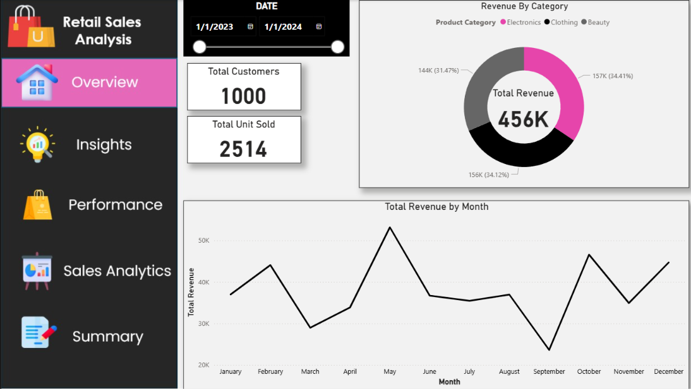
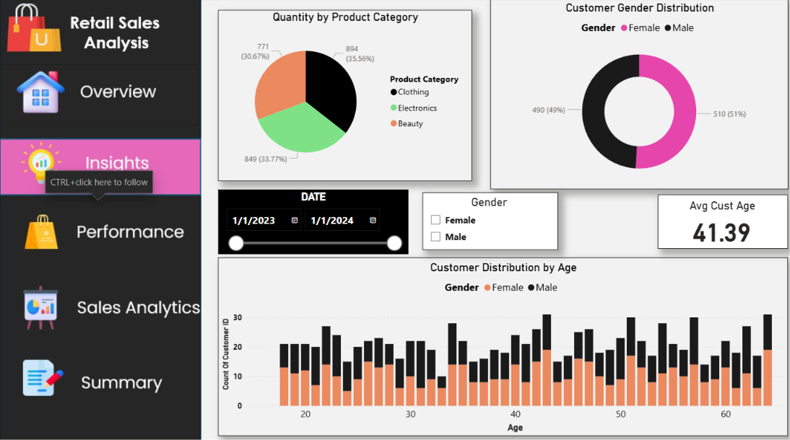
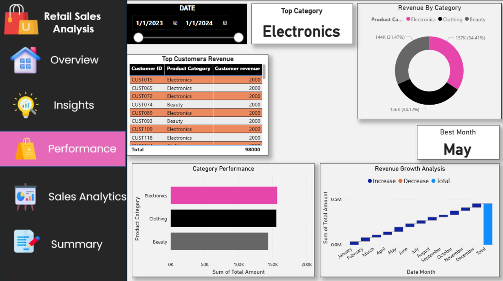
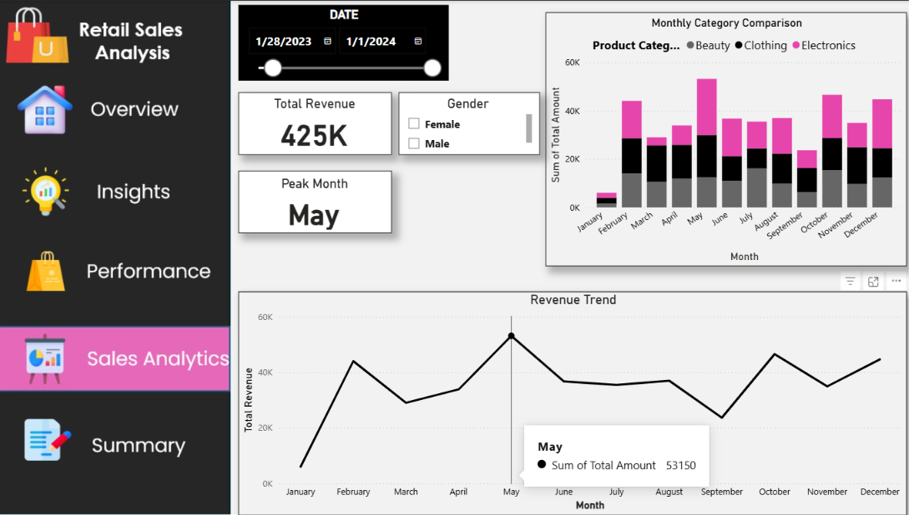
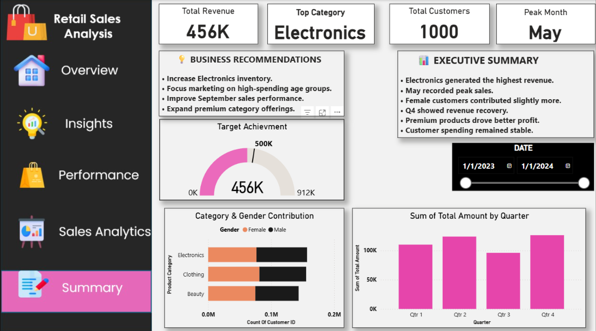

# 🛍️ Retail Sales Analysis Dashboard

<p align="center">
  
</p>

<p align="center">
  <b>Interactive Retail Sales Analysis Dashboard built using Power BI, Power Query, and DAX</b>
</p>

<p align="center">
  Transforming raw retail data into meaningful business insights through interactive data visualization.
</p>

---

## 📌 Table of Contents

- [Project Overview](#-project-overview)
- [Business Objectives](#-business-objectives)
- [Key Performance Indicators](#-key-performance-indicators)
- [Dashboard Pages](#-dashboard-pages)
- [Dashboard Preview](#-dashboard-preview)
- [Key Insights](#-key-insights)
- [Business Recommendations](#-business-recommendations)
- [Tools & Technologies](#️-tools--technologies)
- [Project Workflow](#-project-workflow)
- [How to Use](#-how-to-use)
- [Project Highlights](#-project-highlights)
- [Author](#-author)

---

# 📊 Project Overview

The **Retail Sales Analysis Dashboard** is an interactive Business Intelligence project developed using **Power BI**. The purpose of this project is to analyze retail sales data and transform it into meaningful insights that can help businesses make data-driven decisions.

The dashboard provides a comprehensive view of retail performance by analyzing:

- 💰 Total Revenue
- 👥 Customer Distribution
- 📦 Units Sold
- 🛍️ Product Category Performance
- 📈 Monthly Revenue Trends
- 📊 Quarterly Revenue Analysis
- 👤 Customer Gender Distribution
- 🎂 Customer Age Distribution
- 🏆 Top Customers
- 📅 Peak Sales Month
- 📈 Revenue Growth Trends

The project is designed with multiple interactive pages, allowing users to explore business performance from different perspectives.

---

# 🎯 Business Objectives

The primary objectives of this project are:

1. Analyze overall retail sales performance.
2. Monitor total revenue generated by the business.
3. Identify the highest-performing product category.
4. Analyze monthly and quarterly sales trends.
5. Identify peak sales periods.
6. Understand customer demographics.
7. Analyze customer behavior based on age and gender.
8. Identify top customers contributing to revenue.
9. Compare performance across product categories.
10. Generate actionable business recommendations based on data insights.

---

# 📈 Key Performance Indicators

| KPI | Value |
|-----|-------|
| 💰 Total Revenue | **456K** |
| 👥 Total Customers | **1,000** |
| 📦 Total Units Sold | **2,514** |
| 🏆 Top Category | **Electronics** |
| 📅 Peak Month | **May** |
| 👤 Average Customer Age | **41.39** |

These KPIs provide a quick overview of the overall business performance.

---

# 🖥️ Dashboard Pages

The Power BI dashboard consists of **five interactive analytical pages**.

| Page | Purpose |
|------|---------|
| 🏠 Overview | High-level business performance summary |
| 💡 Insights | Customer demographics and product analysis |
| 📈 Performance | Category and revenue performance analysis |
| 📊 Sales Analytics | Monthly sales and revenue trend analysis |
| 📝 Summary | Executive summary and business recommendations |

---

# 🖥️ Dashboard Preview

## 🏠 1. Overview Dashboard

The **Overview page** provides a high-level summary of overall retail performance.

### Key Metrics & Visuals:

- Total Customers
- Total Units Sold
- Total Revenue
- Revenue by Product Category
- Monthly Revenue Trend
- Interactive Date Filter

<p align="center">
  
</p>

---

## 💡 2. Customer Insights Dashboard

The **Insights page** focuses on customer demographics and purchasing behavior.

### Key Metrics & Visuals:

- Quantity by Product Category
- Customer Gender Distribution
- Customer Distribution by Age
- Average Customer Age
- Gender Filter
- Date Filter

This analysis helps understand customer segments and their contribution to the business.

<p align="center">
  
</p>

---

## 📈 3. Performance Dashboard

The **Performance page** analyzes revenue contribution and product category performance.

### Key Metrics & Visuals:

- Top Customers by Revenue
- Revenue by Category
- Category Performance
- Revenue Growth Analysis
- Best Performing Month
- Top Product Category

This page helps identify the strongest revenue contributors and monitor business growth.

<p align="center">
  
</p>

---

## 📊 4. Sales Analytics Dashboard

The **Sales Analytics page** provides detailed analysis of monthly sales performance.

### Key Metrics & Visuals:

- Monthly Category Comparison
- Revenue Trend
- Total Revenue
- Peak Month
- Gender Analysis
- Interactive Date Filter

This page helps identify sales patterns and seasonal performance.

<p align="center">
  
</p>

---

## 📝 5. Executive Summary Dashboard

The **Summary page** provides a consolidated executive-level overview of business performance.

### Key Metrics & Visuals:

- Business Recommendations
- Executive Summary
- Target Achievement
- Category & Gender Contribution
- Quarterly Revenue Analysis
- Total Revenue
- Peak Sales Month

This page converts analytical findings into actionable business recommendations.

<p align="center">
  
</p>

---

# 🔍 Key Insights

Based on the dashboard analysis, the following insights were identified:

### 🏆 Electronics is the Top Performing Category

Electronics generated the highest revenue compared to other product categories. This indicates strong customer demand and significant revenue contribution from the Electronics category.

---

### 📅 May Recorded Peak Sales

May emerged as the highest-performing month in terms of revenue. Businesses can use this information to prepare inventory and marketing campaigns before peak periods.

---

### 👥 Balanced Customer Distribution

The dashboard shows a relatively balanced distribution between male and female customers. This indicates that both customer segments contribute significantly to overall business performance.

---

### 📈 Revenue Fluctuates Across Months

Monthly revenue analysis shows fluctuations throughout the year. Identifying high-performing and low-performing months can help businesses improve sales strategies.

---

### 🛍️ Product Categories Contribute Differently

Electronics, Clothing, and Beauty categories contribute differently to total revenue. Category-level analysis helps identify where businesses should focus their inventory and marketing investments.

---

### 👤 Customer Age Analysis Provides Valuable Insights

Customer age distribution helps businesses understand their primary customer segments and create targeted marketing campaigns based on customer demographics.

---

# 💡 Business Recommendations

Based on the insights generated from the dashboard, the following recommendations can be considered:

### 1️⃣ Increase Electronics Inventory

Since Electronics is the highest-performing category, maintaining sufficient inventory can help avoid stock shortages during high-demand periods.

### 2️⃣ Focus Marketing on High-Value Customers

Businesses should identify high-spending customers and provide personalized offers, loyalty programs, or exclusive promotions.

### 3️⃣ Prepare for Peak Sales Months

Since May recorded the highest revenue, businesses should prepare inventory, staff, and marketing campaigns before expected peak periods.

### 4️⃣ Improve Low-Performing Months

Analyze the reasons behind lower sales months and introduce targeted promotional strategies to improve performance.

### 5️⃣ Use Customer Demographics for Targeted Marketing

Age and gender analysis can help create personalized marketing campaigns for different customer segments.

### 6️⃣ Expand High-Performing Product Categories

High-performing categories can be expanded by introducing additional premium or complementary products.

---

# 🛠️ Tools & Technologies

| Tool / Technology | Purpose |
|-------------------|---------|
| 📊 Power BI | Dashboard Development & Data Visualization |
| ⚙️ Power Query | Data Cleaning & Transformation |
| 🧮 DAX | KPI & Measure Calculations |
| 📈 Data Visualization | Business Insights & Reporting |
| 🗄️ Data Analysis | Exploratory and Performance Analysis |

---

# ⚙️ Project Workflow

The project follows a structured Business Intelligence workflow:

```text
Raw Data
   │
   ▼
Data Cleaning
   │
   ▼
Data Transformation
   │
   ▼
Data Modeling
   │
   ▼
DAX Calculations
   │
   ▼
Data Visualization
   │
   ▼
Interactive Dashboard
   │
   ▼
Business Insights
   │
   ▼
Business Recommendations
